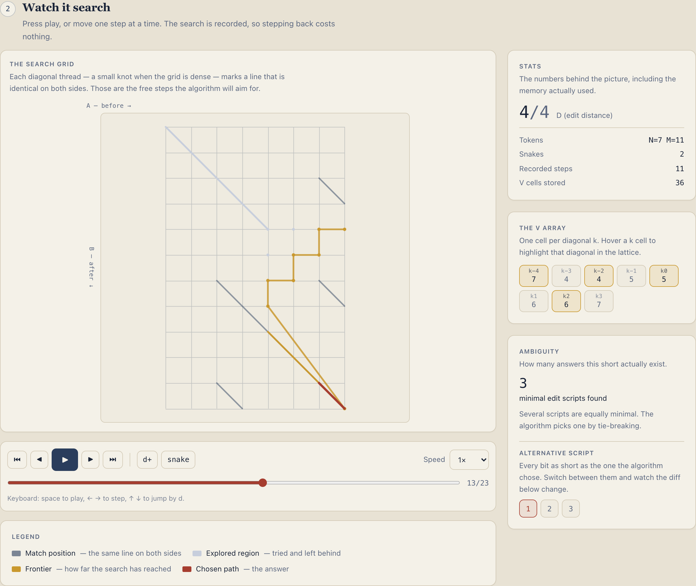
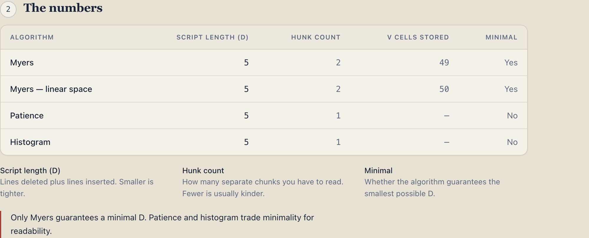

<p align="center">
  <picture>
    <source media="(prefers-color-scheme: dark)" srcset="docs/media/banner-dark.png">
    
  </picture>
</p>

<p align="center">
  <strong>The Myers diff algorithm, made watchable.</strong><br>
  See the edit graph, watch the frontier expand, follow the backtrack that recovers the edit script —<br>
  and find out why diffs sometimes attribute the wrong lines.
</p>

<p align="center">
  <a href="https://andifathulms.github.io/myers-visualizer/"><strong>Open the live site →</strong></a>
</p>

---

`git diff` runs on essentially every working day of a developer's life, and almost nobody knows what it does. It is a shortest-path search over a lattice — an actual graph search, with a frontier and a backtrack — and none of that is visible in the output.

This runs that search slowly enough to watch, on your own input, and states plainly the fact that explains the ugly diffs everybody has seen: **a shortest edit script is usually not unique**, and which of several equally-minimal ones you get is decided by tie-breaking, not by any judgement about which reads better.

<p align="center">
  
</p>

## What it does

| | |
|---|---|
| **Edit graph** | The lattice on canvas: match positions marked before the search starts, the explored region filling as `d` increases, the frontier advancing in turmeric, snakes as unbroken diagonal threads, and the chosen path drawn back through it in madder. |
| **The V array** | The frontier as an indexed strip, one cell per diagonal `k`. Hover a cell to highlight that diagonal in the lattice. |
| **Diff output** | Unified diff of the recovered script. Click a line to see the move that produced it. |
| **Ambiguity** | How many equally minimal scripts exist, and what the alternatives look like — including the one that attributes a closing brace to the wrong function. |
| **Comparison** | Myers, linear-space Myers, patience and histogram on the same input, with script length, hunk count and retained `V` cells side by side. |
| **Linear space** | The bidirectional variant: two frontiers converging, the middle snake where they meet, then recursion. |
| **Stepping** | Play, pause, step, step back, jump by `d`, jump by snake, scrub, speed. Stepping back is free — the search is recorded, not re-run. |

Static site, no backend, no diff library. English by default, with a full Indonesian locale at `/id`. Algorithm terms stay in English in both, so they are recognisable in the paper and in source code.

### Why `--patience` exists, as two numbers

Git ships alternative diff algorithms because *minimal* is not the same as *readable*. On the shipped `patience-wins` preset all four algorithms agree that `D = 5` — equally minimal — and patience still produces the better diff, because it refuses to anchor on lines that appear more than once:

<p align="center">
  
</p>

## The three things that shape the code

1. **The apply property is the backbone.** Applying a recovered edit script to A must produce B, exactly — for every algorithm, every input, every option. `lib/diff/apply.ts` is the independent verifier and shares no code with any search.
2. **A shortest edit script is not unique.** Multiple minimal scripts routinely exist, so nothing asserts that two implementations produce the *same script* — only the same `D`.
3. **`V` is indexed by `k = x - y`, which can be negative.** The offset lives in exactly one place, behind named accessors.

## Getting started

```bash
pnpm install
pnpm dev                   # http://localhost:3000
```

```bash
pnpm build                 # static export to ./out
pnpm preview               # serve ./out under the production basePath
pnpm test                  # vitest watch
pnpm test:run              # vitest once — before every commit
pnpm test:apply            # apply property across the generated corpus
pnpm test:oracle           # brute-force minimal D agreement
pnpm test:determinism
pnpm test:browser          # smoke the built export in real Chrome
pnpm bench:render          # canvas lattice render benchmark
pnpm typecheck
pnpm lint
```

`pnpm test:apply` and `pnpm test:oracle` gate any change to `lib/diff`.

## How it is built

```
A, B, granularity, algorithm
  → tokenize        → integer ids + equality classes
  → search (pure)   → SearchTrace (V snapshots, snakes, frontier per d)
  → backtrack       → EditScript
                    → graph | V strip | diff output | comparison
```

Next.js 14 App Router with `output: 'export'`, TypeScript `strict`, Tailwind, Vitest, pnpm. The search runs in a worker with a step budget; the lattice renders on canvas, never as DOM. `lib/diff` is pure — no clock, no randomness, no DOM, no module-level state — so the same inputs give byte-identical output.

**The search operates on integers, never strings.** Tokenization happens first and produces integer ids, so equality in the search is integer comparison. That is what real implementations do, and it makes the equality relation an explicit choice rather than a hidden one.

## Performance

The edit graph is the product, so the render was proven before any algorithm work. `pnpm bench:render` builds the export, serves it under the production basePath, drives the 300×300 spike in headless Chrome and fails if the budget is blown.

```
render bench — 300×300 lattice, 220 frames
  canvas           900×900 px
  draw mean        0.13 ms
  draw p95         0.30 ms
  frame median     16.70 ms (59.9 fps)
  frame p95        17.20 ms
  budget           16.7 ms
```

The frame interval is the meaningful number: rAF held 60fps for 220 consecutive frames while redrawing the frontier every frame. Headless Chrome rasterises canvas in software, so this is a floor, not a best case.

What makes it affordable is layering — grid threads and 90 000 match knots are drawn once to a cached layer, the explored wash is stamped incrementally, and only the frontier, snakes and path are redrawn per frame. `tests/render/frame-cost.test.ts` enforces that in CI, where a timing benchmark would only produce false failures.

First-load JS is 87 KB gzipped shared, 107 KB on the graph page, against a 250 KB budget.

## Browser verification

`pnpm test:browser` builds the export, serves it under the production basePath and drives it in real Chrome. Two shipped code paths cannot run under jsdom at all, and this is the only thing that exercises them:

- **The worker.** jsdom has no `Worker`, so the unit tests only ever hit `useDiff`'s synchronous fallback. The smoke test asserts the worker chunk is actually requested.
- **The painting.** A jsdom canvas is a stub, so "the lattice renders" was otherwise asserted by counting draw calls. The smoke test reads pixels back.

It also verifies the offline claim the way it has to be verified: load the page, let the service worker install, cut the network, reload, and check the search still runs and the lattice still paints. It fetches the favicon, the touch icon, the manifest and every icon the manifest declares, because each of those fails silently when a path is wrong — no install prompt, a blank tab, an empty social card, and nothing on screen to say so. And it checks the worst case at the input cap — 300 × 300 with nothing in common, so `D = 600`, 135 152 recorded steps and 362 404 retained `V` cells. The search runs in a worker, so the main thread stays responsive throughout; when the result lands there is a one-time hitch of roughly 100–200 ms while the trace is deserialised and the timeline built. That is a hitch, not a freeze, and only on the deliberately pathological input.

Point it at production with `SMOKE_URL=https://andifathulms.github.io/myers-visualizer pnpm test:browser`.

## Testing

Some 3 600 tests, built around properties rather than fixtures:

- **Apply.** Every script from every algorithm must take A to B.
- **Oracle.** A brute-force BFS over the edit graph — sharing no idea with Myers — gives the true minimal `D`, and Myers must match it. The oracle computes `D` twice by different means and is checked against itself first.
- **Minimality ordering.** `D_myers ≤ D_patience` and `D_myers ≤ D_histogram`, with a case where the inequality is strict so the assertion is not vacuous.
- **Cross-variant.** Greedy and linear-space report the same `D`; they are permitted to return different scripts.
- **Trace well-formedness.** Every snake is a genuine diagonal run of matches, the frontier never retreats, every non-diagonal move costs exactly one.
- **Determinism.** Same inputs, byte-identical trace.
- **Presets.** Each preset asserts the phenomenon it claims to show, so the copy cannot quietly stop being true. Two preset claims were written before they were checked and both turned out to be false; they were replaced with inputs that actually demonstrate the phenomenon.

Edge fixtures are permanent: empty A, empty B, both empty, identical, fully disjoint, single elements, heavily repeated elements.

## Brand and install

The mark is the shortest-path staircase through an edit graph — starting on the cream dot, ending on the red one, where the attribution is decided. Asset masters live in `exports/` and are not committed; the shipped subset is `app/icon.svg`, `app/apple-icon.png` and `public/brand/`. The site is installable: `public/manifest.webmanifest` declares the 192, 512 and maskable icons, and opens on the edit graph rather than the home page.

## Not git

Git applies additional heuristics and fallbacks on top of Myers. This makes no claim of byte-identical parity with `git diff`, and the tie-breaking here demonstrably differs from git's on some inputs.

## Reading

- Myers, *An O(ND) Difference Algorithm and Its Variations*, Algorithmica 1(2):251–266, 1986 — unusually readable, and the source of the notation used throughout the code.
- [James Coglan's series on the Myers diff algorithm](https://blog.jcoglan.com/2017/02/12/the-myers-diff-algorithm-part-1/) — the best written explanation available.

## Deployment

Live at **https://andifathulms.github.io/myers-visualizer/**

`main` builds and deploys to GitHub Pages via Actions. The workflow runs typecheck, lint, the apply property and the oracle before it builds, and fails outright if `out/.nojekyll` is missing — without it Jekyll drops `_next/` and the site serves blank.

`basePath` must match the repository name. It is also hardcoded in `scripts/postbuild.mjs`, which generates the service worker — with a precache manifest and a cache version derived from the build's content rather than a clock, so an unchanged build does not churn browsers' caches — and in `public/manifest.webmanifest`, which `tests/ui/manifest.test.ts` pins. Renaming the repository means changing all three.

## Licence

MIT — see [LICENSE](LICENSE).

---

<sub>Designed &amp; built by <a href="https://andifathulms.github.io/en/">Andi Fathul Mukminin</a>.</sub>
